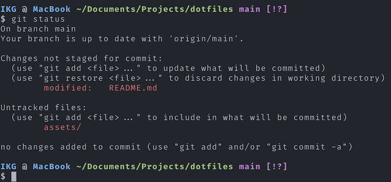

# Dotfiles

My configuration for macOS and Linux. Download with a simple command:

```bash
curl -L https://codeberg.org/parser/dotfiles/raw/branch/main/remote-install.sh | sh
```

Then bootstrap with:

```bash
cd dotfiles/
bash bootstrap.sh
```

Contains setup for Bash, Homebrew, macOS defaults, Alacritty, Zed, and more.



## Credits

A lot of stuff was taken from
<br>
https://github.com/mathiasbynens/dotfiles/
<br>
and
<br>
https://github.com/paulirish/dotfiles/
<br>
and
<br>
https://github.com/paulmillr/dotfiles/
