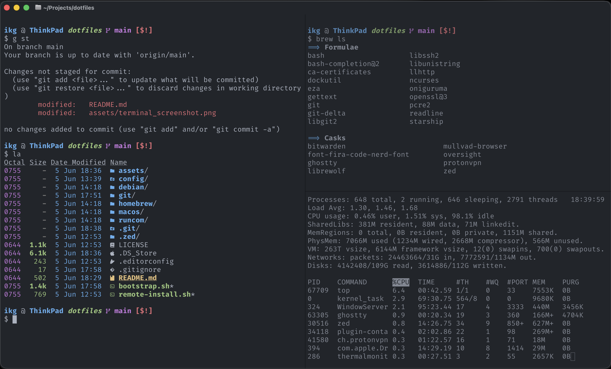

# Dotfiles

My configuration for macOS and Linux.

## Install

Download with:

```bash
curl -L https://codeberg.org/parser/dotfiles/raw/branch/main/scripts/remote-install.sh | sh
cd dotfiles/
```

### macOS

```bash
bash macos/install.sh  # installs Homebrew, installs packages, switches to modern bash
bash scripts/bootstrap.sh # symlinks configs, prompts for Git config setup, applies macOS defaults
```

### Linux (Debian-based)

```bash
bash scripts/bootstrap.sh  # symlinks configs, prompts for Git config setup, runs debian/install.sh
```

## What gets linked

| Source | Destination |
|---|---|
| `config/<dir>/` | `~/.config/<dir>/` |
| `home/.<file>` | `~/.<file>` |

Configs: Ghostty, Git, Starship, Zed

Shell dotfiles: `.aliases`, `.bash_profile`, `.bashrc`, `.exports`, `.inputrc`

## Uninstall

```bash
bash scripts/uninstall.sh  # only removes symlinks bootstrap.sh created
```


